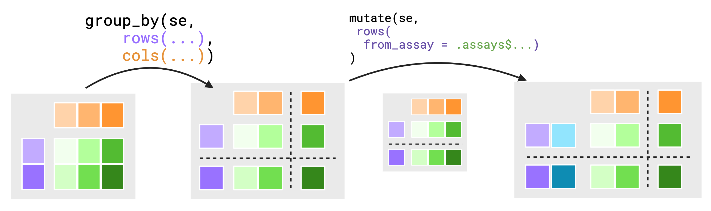

# Quick start

`biocmask` provides efficient abstractions to the *SummarizedExperiment* such
that using common dplyr functions feels as natural to operating on a
*data.frame* or *tibble*. `biocmask` uses
[data-masking](https://rlang.r-lib.org/reference/topic-data-mask-programming.html)
from the `rlang` package in order to connect dplyr functions to
*SummarizedExperiment* slots in a manner that aims to be intuitive and avoiding
ambiguity in outcomes.

## Supported data types and operations

`biocmask` works on *SummarizedExperiment* objects, as well as most
classes derived from this, including *DESeqDataSet*,
*SingleCellExperiment*, etc.

It supports the following operations:

* `mutate`
* `select`
* `summarize`
* `pull`
* `filter`
* `arrange`

## Typical use case

```{r message=FALSE, warning=FALSE}
library(airway)
data(airway)
library(dplyr)
```

```{r echo=FALSE}
# clean up the metadata a bit to make it easier to view
colData(airway) <- colData(airway)[,1:4]
rowData(airway) <- rowData(airway)[,c(1:2,4)]
```

```{r message=FALSE}
library(biocmask)
# add data (mutate) to any of the three tables,
# assay, colData, rowData,
# ...using contextual helpers cols() and rows()
airway |>
  mutate(log_counts = log1p(counts),
         cols(treated = dex == "trt"),
         rows(new_id = paste0("gene-", gene_name)))
```

The operations can span contexts, and only the necessary data will be extracted
from each context for computation:

```{r}
airway$sizeFactor <- runif(8, .9, 1.1)

# making scaled counts, then computing row means:
airway |>
  mutate(scaled_counts = counts / .cols$sizeFactor, #
         rows(ave_scl_cts = rowMeans(.assays_asis$scaled_counts)))
```

Calling `.cols` in the assay context produces an object of the matching size and
orientation to the other assay data.

Alternatively we could have used *purrr* to compute row means:

```{r}
airway |>
  mutate(scaled_counts = counts / .cols$sizeFactor,
         # You may expect a list when accessing other contexts
         # from either the rows() or cols() contexts.
         rows(ave_scl_cts = purrr::map_dbl(.assays$scaled_counts, mean)))
```

See below for details on how objects are made available across contexts.

`biocmask` also enables common grouping and summarization routines:


```{r}
summary <- airway |>
  group_by(rows(gene_biotype)) |>
  summarize(col_sums = colSums(counts),
            # may rename rows with .features
            rows(.features = unique(gene_biotype)))
# summarize returns a SummarizedExperiment here,
# retaining rowData and colData

summary |> rowData()

# visualizing the output as a tibble:
library(tibble)
summary |>
  pull(col_sums) |>
  as_tibble(rownames = "type")
```

## Related work

We note that `biocmask` is highly related to other *tidyomics* projects including:

* tidySummarizedExperiment
* plyranges
* DFplyr
* and more.

Here we have focused on the design principles of function *endomorphism*
(returning the same object that was input), avoiding ambiguity through strictly
defined behavior (potentially at the expense of longer code), and allowing
the user the convenience of multiple expressions for the same result, some of
which may have improved computational performance.

### A Note on `tidySummarizedExperiment`

At the moment, `biocmask` and `tidySummarizedExperiment` export conflicting 
functions as they both define `dplyr` methods for manipulating the 
`SummarizedExperiment` class. `biocmask` exists as an alternative to 
`tidySummarizedExperiment` and enables a unique approach to working with the
`SummarizedExperiment` class. We advise limiting your analysis to one package 
or another, as which methods that are available in your search path depends on
the order in which the packages are attached leading to unexpected behaviors.

# Manipulating *SummarizedExperiment* with `biocmask`
<!-- copied from README -->
<!-- unsure if it is better here or in README -->
The `SummarizedExperiment` object contains three main components/"contexts" that we mask, 
the `assays()`, `rowData()`[^1] and `colData()`.

[^1]: At this moment `rowRanges()` is not supported in `biocmask` but may become
its own pronoun in the future.

```{r}
#| fig.cap: Simplified view of data masking structure. Figure made with [Biorender](https://biorender.com)
#| echo: false
knitr::include_graphics("../man/figures/Overview-bindings.png")
```

`biocmask` provides variables as-is to data **within their current contexts** enabling you 
to call S4 methods on S4 objects with `dplyr` verbs. If you require access to
variables _outside the context_, you may use 
pronouns made available through `biocmask` to specify where to find those 
variables.

```{r}
#| echo: false
#| fig.cap: Simplified view of reshaping pronouns. Arrows indicates to where the pronoun provides access. For each pronoun listed, there is an `_asis` variant that returns underlying data without reshaping it to fit the context. Figure made with [Biorender](https://biorender.com)
knitr::include_graphics("../man/figures/Overview-pronouns.png")
```

The `.assays`, `.rows` and `.cols` pronouns outputs depends on the evaluating 
context. Users should expect that the underlying data returned from `.rows` or
`.cols` pronouns in the _**assays context**_ is a vector, replicated to match 
size of the assay context.

\

Alternatively, using a pronoun in either the `rows()` or `cols()` 
contexts will return a list equal in length to either `nrows(rowData())`
or `nrows(colData())` respectively.

## assay context
<!-- taken from the presentation -->
* Default evaluation context
* `.assays` $\to$ contextual pronoun, returns list of the matrix, sliced by the dimension it was referenced from.
  * within the rowData context: `.assays$foo` is an alias for `lapply(seq_len(nrow()), \(i, x) x[i,,drop=FALSE], x = foo)`
  * within the colData context: `.assays$foo` is an alias for `lapply(seq_len(ncol()), \(i, x) x[,i,drop=FALSE], x = foo)`
* `.assays_asis` $\to$ pronoun to direct bindings in `assays()`
* `assay_ctx(expr, asis = FALSE)` $\to$ short hand to bind the assay context in front of the current context.

## rows context

* `rows(...)` $\to$ sentinel function call to indicate evaluation context.
* `.rows` $\to$ contextual pronoun
  * within assay context: `.rows$foo` is an alias for `vctrs::vec_rep(foo, times = ncol())`
  * within colData context: `.rows$foo` is an alias for `vctrs::vec_rep(list(foo), times = n())`
* `.rows_asis` $\to$ pronoun to direct bindings in `rowData()`
* `row_ctx(expr, asis = FALSE)` $\to$ shorthand to bind the rowData context in front of the current context

## cols context

* `cols(...)` $\to$ sentinel function call to indicate evaluation context.
* `.cols` $\to$ contextual pronoun
  * within assay context: `.cols$foo` is an alias for `vctrs::vec_rep_each(foo, times = nrow())`
  * within rowData context: `.rows$foo` is an alias for `vctrs::vec_rep(list(foo), times = n())`
* `.cols_asis` $\to$ pronoun to direct bindings in `colData()`
* `col_ctx(expr, asis = FALSE)` $\to$ shorthand to bind the colData context in front of the current context

## Multiple expressions enabled via `biocmask`

We can compare two ways of dividing out a vector from `colData` along the
columns of `assay` data:

```{r}
# here the `.cols$` pronoun reshapes the data to fit the `assays` context
airway |>
  mutate(scaled_counts = counts / .cols$sizeFactor)

# this is equivalent to the following, where we have to transpose
# the `counts` assay data twice to enable the correct recycling
# of the size factor vector
airway |>
  mutate(scaled_counts = t(t(counts) / .cols_asis$sizeFactor))
```

# Advanced features

## Object integrity

`biocmask` provides an opinionated framework for how `dplyr` verbs should interact
with `SummarizedExperiment` objects. In general, `biocmask` will not allow any
operations that it could not guarantee a valid return object.

It is for this reason that `arrange()`,  `filter()` and `group_by()` do not 
allow operations in the default assay context, as this would likely break the
assumed structure of a `SummarizedExperiment` object.

## `group_by()`

`biocmask` also supports `group_by` operations allowing users to query information
with `dplyr::n()` or `dplyr::cur_group_id()`. However due to the linked structure
of a `SummarizedExperiment` object and `biocmask` providing multiple evaluation 
contexts, grouping operations would be complex and return values would be 
potentionally ambiguous.

It is for this reason that groupings are themselves **contextual**. The assay 
context is dependently linked to both the groupings of the rows and cols contexts
but, the grouping of rows is ignored when viewed from the cols context and 
similarly the grouping of cols is ignored when viewed from the rows context.
In this way, we have chosen to make the groupings of rows and cols independent
between each other. The below figure attempts to show how
groupings are conditionally dropped for the scope of an evaluation.

```{r}
#| echo: false
#| fig.cap: When evaluating in row context, groupings along `colData()` are temporarily ignored. Figure created with [Biorender](https://biorender.com)

```

To further motivate this choice, suppose we did not drop grouping values. Assume
you have a small 5 by 4 `SummarizedExperiment` object. Both of the `rowData()` 
and `colData()` are grouped such that there are 2 groups in both `rowData()` and
`colData()` totaling in 4 groups across the assays.

```{r eval=FALSE}
group_by(se_simple, rows(direction), cols(condition)) |>
  mutate(rows(data_from_cols = .cols$condition))
```

The above syntax implies we wish to move data from the `colData()` into the 
`rowData()`. From a previously established conventions, we would expect the 
output to be an alias for `vctrs::vec_rep(list(condition), times = n())`.\
Additionally the `rows()` sentinal will expect that the output of `.cols$condition`
will need to match the size of the evaluation context.

Unfortunately, this becomes extremely difficult to resolve with the current 
conventions. Without dropping the `cols()` groupings, each `rows()` grouping is
evaluated equal to the number of groups in `cols()`. At first glance, this may
seem desirable, but the problem arises when considering how theses outputs 
across groups should be stored per group of `rows()`. For example, should the 
output of the `.cols$condition` return a list equal to the number
of groups of the column context? If yes, we would need to consider the size stability
of the output context! Assuming that `rowData()` has at least one group with three
elements, there is no guarentee it would fit (this also makes a poor assumption
that the elements of `rowData()` somehow correspond to the groups of `colData()`).
Thus we would be left with wrapping all the results in a list and replicating to the 
appropriate size. When its all said and done, we would have a list of lists, which
is difficult to reason about, potentionally unexpected and painful to work with.
For this reason the only groupings present in the `rowData()` context are the
groupings in `rowData()`, and similarly for the `colData()` context.

## Printing

Motivated by the `show`/`print` function in *tidySummarizedExperiment*, we
visualize the data as if it was tabular. `biocmask` offers the option to opt-in
on this behavior by setting the associated global option:

```{r eval=FALSE}
options("show_SummarizedExperiment_as_tibble_abstraction" = TRUE)
```

Alternatively, you may use helper functions `use_show_tidy()` and 
`use_show_default()` to enable and disable this alternative printing respectively.

Since `biocmask` aims to leave the input data as-is when possible, we have considered
providing support for printing `S4Vectors` within a `tibble()`. To be clear, 
`biocmask` **will not** allow you to put `S4Vectors` inside a `tibble()`, but 
will allow for `S4Vectors` to be printed with `pillar()`, the formatting engine
behind `tibble()` pretty printing.

To enable this behavior, before any data is reported to the user, we proxy any
`S4Vector` with a custom `vctrs_vctr` object with `biocmask::vec_phantom()`. In
truth, the `vec_phantom` object is a simple integer vector with a "phantomData"
attribute. This allows us to carry along `S4Vector` through `pillar()`'s printing
pipeline until it is time to print the column.

The `pillar_shaft()` method for `vec_phantom` will format the S4 data with
`biocmask_pillar_format()` generic, which by default calls
`S4Vectors::showAsCell()`. Users are free to create their own methods for S4
vectors that differ from `S4Vectors::showAsCell()` if they like, as seen in
``?`biocmask-printing` ``

## renaming rows or columns

Inspired by `tidySummarizedExperiment`, `biocmask` provides access to the 
rownames and colnames of a `SummarizedExperiment` object by installing `.features`
and `.samples` into the `rowData()` and `colData()` contexts respectively.
These are special in that assigning a value to `.features` in the `rowData()` 
context or `.samples` in the `colData()` context does not create a new column,
but changes the rownames or colnames of the resulting object.

```{r}
se_simple
# moving data to rownames and colnames
se_simple |>
  mutate(
    orig_names = sprintf(
      "%s-%s",
      # .features is installed in the rows() context
      .rows$.features,
      # .samples is installed in the cols() context
      .cols$.samples),
    rows(.features = gene,
         # deleting rowData column
         gene = NULL),
    cols(.samples = sample,
         # deleting colData column
         sample = NULL)
  )

```

# Troubleshooting and best practices

while `biocmask` takes inspiration from the data masks used in `dplyr`, they 
are unfortunately more complex. This means there is some overhead in creating
the evaluation mask per dplyr verb. Try to reduce the number of `dplyr` verb calls
and instead increase the content of each verb. For example instead of doing:

```{r eval=FALSE}
.data |>
  mutate(foo = bar) |>
  mutate(baz = foo^2)
```

do the following

```{r eval=FALSE}
.data |>
  mutate(
    foo = bar,
    baz = foo^2
  )
```

# Community and support

Please feel free to post questions about `biocmask` to:

* the [Bioconductor support site](https://support.bioconductor.org/)
* as an [Issue](https://github.com/jtlandis/biocmask/issues) on GitHub
* in the `#tidiness_in_bioc` channel on the *community-bioc* Slack

For code contributions:

* For small fixes, feel free to post a PR on GitHub
* For larger structural changes to the package code, please reach out to the
  development team first through one of the above channels.

Thanks for your interest in `biocmask`!

# Session info

```{r}
devtools::session_info()
```

# References
